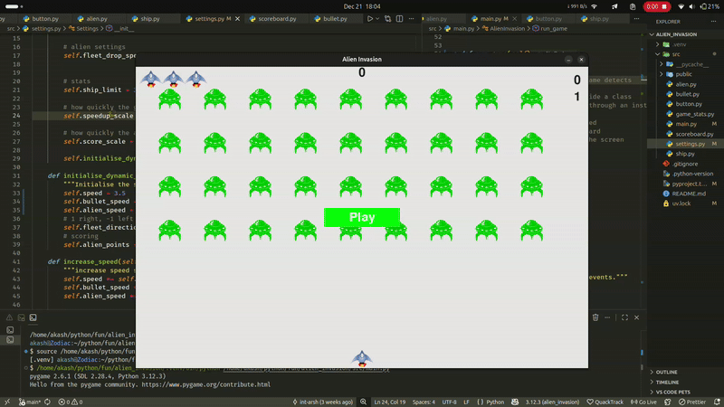

#  Alien Invasion

A classic arcade-style space shooter game built with Python and Pygame. Defend Earth from waves of alien invaders in this action-packed retro gaming experience!



##  About

Alien Invasion is a 2D arcade game where you control a spaceship at the bottom of the screen, shooting at descending fleets of aliens. As you progress through levels, the game becomes increasingly challenging with faster-moving enemies and more intense gameplay.

##  Features

- **Dynamic Difficulty**: Game speed increases progressively as you clear alien fleets
- **Fullscreen Gameplay**: Immersive gaming experience in fullscreen mode
- **Score Tracking**: Keep track of your performance with a built-in scoring system
- **Lives System**: Three lives to survive against the alien invasion
- **Smooth Controls**: Responsive ship movement and bullet firing mechanics
- **Fleet Mechanics**: Aliens move in formation and drop down as they reach screen edges

## 🎮 How to Play

- **Move Left**: `←` (Left Arrow Key)
- **Move Right**: `→` (Right Arrow Key)
- **Fire**: `Space` bar
- **Start Game**: Click the "Play" button or click anywhere on screen
- **Quit**: Press `Q` or close the window

### Objective

Destroy all aliens before they reach the bottom of the screen. Each alien you destroy increases your score. If aliens reach your ship or you run out of lives, the game ends!

## 🛠️ Installation

### Prerequisites

- Python 3.12 or higher
- pip (Python package manager)

### Setup

1. **Clone the repository**
   ```bash
   git clone https://github.com/int-arsh/alien_invasion.git
   cd alien_invasion
   ```

2. **Create a virtual environment** (recommended)
   ```bash
   python -m venv .venv
   source .venv/bin/activate  # On Windows: .venv\Scripts\activate
   ```

3. **Install dependencies**
   ```bash
   pip install pygame
   ```

   Or using the project file:
   ```bash
   pip install -e .
   ```

##  Running the Game

From the project root directory:

```bash
python src/main.py
```

Or if you're in the `src` directory:

```bash
python main.py
```

## 📁 Project Structure

```
alien_invasion/
├── src/
│   ├── main.py          # Main game loop and core logic
│   ├── alien.py         # Alien sprite and behavior
│   ├── ship.py          # Player ship class
│   ├── bullet.py        # Bullet mechanics
│   ├── button.py        # UI button components
│   ├── settings.py      # Game configuration and settings
│   ├── game_stats.py    # Game statistics and state
│   ├── scoreboard.py    # Score display and tracking
│   └── public/
│       ├── alien.bmp    # Alien sprite image
│       └── ship.bmp     # Ship sprite image
├── pyproject.toml       # Project dependencies
└── README.md            # This file
```

## �� Game Mechanics

### Difficulty Progression
- Speed increases by 10% after each level completion
- Bullet speed and alien speed scale together
- Fleet direction alternates as they reach screen edges

### Scoring System
- Points awarded for each alien destroyed
- Track your progress through the built-in scoreboard

### Lives
- Start with 3 lives
- Lose a life when aliens reach your ship
- Game ends when all lives are lost

## 🔧 Configuration

Game settings can be modified in `src/settings.py`:

- **Ship speed**: Control movement responsiveness
- **Bullet properties**: Speed, size, color, and limit
- **Alien behavior**: Speed, drop distance, and direction
- **Screen settings**: Background color and dimensions
- **Difficulty scaling**: Speed increase rate between levels

## 🤝 Contributing

Contributions are welcome! Feel free to:

- Report bugs
- Suggest new features
- Submit pull requests
- Improve documentation

## 📝 License

This project is open source and available for educational purposes.

## 🙏 Acknowledgments

- Built with [Pygame](https://www.pygame.org/)
- Inspired by classic arcade space shooters
- Created as a Python learning project

## 📧 Contact

**Author**: Akash  
**GitHub**: [@int-arsh](https://github.com/int-arsh)

---

*Enjoy the game and happy alien hunting! 👾*
